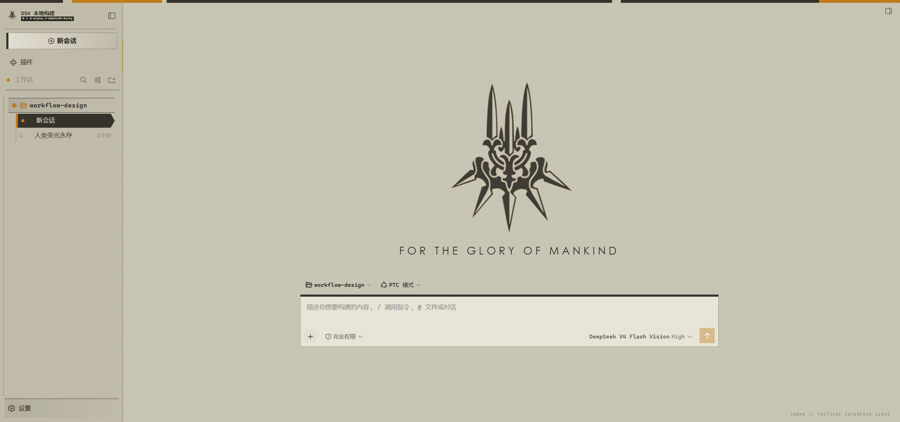
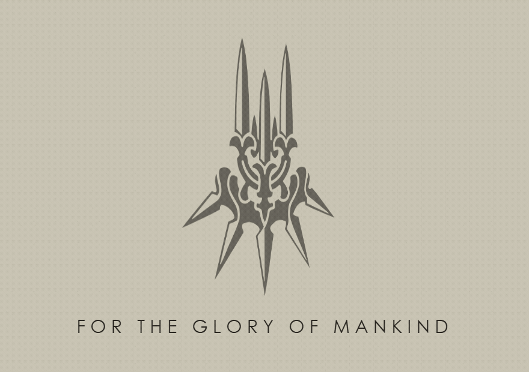

# dsh-yorha-ui

English | [简体中文](README.zh-CN.md)

[](https://github.com/MrmoLabs/dsh-yorha-ui/actions/workflows/ci.yml)
[](https://www.npmjs.com/package/dsh-yorha-ui)
[](https://github.com/MrmoLabs/dsh-yorha-ui/releases)
[](LICENSE)

A **NieR:Automata / YoRHa-inspired industrial terminal theme** for DeepSeek Harness Web.

It reshapes the DSH Web workspace, session list, composer, and overlays with sand-toned paper, charcoal structural lines, and amber status markers while preserving the original interactions and light/dark appearance modes.


> Theme preview: a structured representation of the plugin's actual visual rules. It contains no additional animation or game assets.





> Live hero preview: the lockup smoothly rotates Bunker-screen style at half the composer width, floating above the 24px geometric `FOR THE GLORY OF MANKIND` salute.

## Features

- Sand and charcoal palettes that follow the DSH appearance mode
- Square geometry, hard borders, and shadow-free industrial surfaces
- YoRHa-style workspace navigation with project headers, mechanical rails, and a reverse-video active session
- A 32px registration grid, subtle paper texture, and segmented system rail
- Consistent colors for the composer, menus, dialogs, code blocks, and syntax highlighting
- Blank-session hero rebrand: the YoRHa lockup (mark + letterforms, traced from the fan-made [YoRHaLogo](https://github.com/gigsoll/YoRHaLogo) vector) replaces the whale through the official `conversation.hero.brand.mark` slot, slowly rotating Bunker-screen style above the `FOR THE GLORY OF MANKIND` salute; the sidebar rail brand mark wears the same lockup
- A clickable `YoRHa // TACTICAL INTERFACE 11945` repository link in the lower-right corner
- No runtime CDN, image dependencies, or game assets
- Theme-token overrides that survive DSH theme repaints

## Install

### Install from npm (stable release)

Install the current stable release from npm:

```powershell
dsh plugin --profile web add -w dsh-yorha-ui
```

Without a globally installed `dsh` command:

```powershell
npx.cmd --yes @deepseek-ai/dsh@latest plugin --profile web add -w dsh-yorha-ui
```

### Install from source

```powershell
git clone https://github.com/MrmoLabs/dsh-yorha-ui.git
cd dsh-yorha-ui
pnpm install
pnpm run build
dsh plugin --profile web add -w .
```

Restart DSH Web after installation, then refresh `http://127.0.0.1:3080`.

## Update and uninstall

Update the npm release:

```powershell
dsh plugin --profile web update -w dsh-yorha-ui
```

Uninstall the plugin:

```powershell
dsh plugin --profile web remove -w dsh-yorha-ui
```

If you previously installed a local development link, remove that link before installing `dsh-yorha-ui`.

## Development and verification

Node.js 22 or later is required.

```powershell
pnpm install
pnpm run check
pnpm test
npm.cmd pack --dry-run
```

The repository pins pnpm 10 through `packageManager`; Corepack-enabled environments will select the matching version automatically. `pnpm test` rebuilds the package before running the regression suite.

Build output is written to `dist/`:

- `dist/index.js`: DSH host entry
- `dist/client.js`: self-registering browser bundle with no relative runtime dependencies

## Automated releases

The repository contains two GitHub Actions workflows:

- `CI` installs dependencies, type-checks, runs regression tests, rebuilds, and verifies the package on every push to `main` and every pull request.
- `Release` verifies that a pushed `v*` tag matches the `package.json` version, runs the same checks and regression tests, creates a GitHub Release with the `.tgz` archive attached, and publishes the same archive through npm Trusted Publishing.

## Project scope

`src/client.ts` contains the current theme implementation. `src/prompt`, `src/tools`, `src/templates`, `src/theme/tokens.css`, and `src/types.ts` are early agent-facing plugin drafts. They are retained as design references and are not included in the current build.

## Disclaimer

This is an unofficial community theme. It is not affiliated with Square Enix, PlatinumGames, or the NieR franchise rights holders, and it contains no original game assets.

## License

[MIT](LICENSE)
