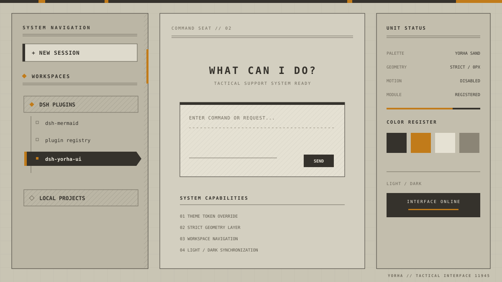

# dsh-yorha-ui

[English](README.md) | 简体中文

[](https://github.com/MrmoLabs/dsh-yorha-ui/actions/workflows/ci.yml)
[](https://www.npmjs.com/package/dsh-yorha-ui)
[](https://github.com/MrmoLabs/dsh-yorha-ui/releases)
[](LICENSE)

为 DeepSeek Harness Web 打造的 **NieR:Automata / YoRHa 工业终端主题**。

它将 DSH Web 的工作区、会话列表、编辑器和浮层统一为沙色纸张、炭黑结构线与琥珀色状态标记，同时保留浅色/深色模式和原有交互逻辑。



> Theme preview：展示的是插件实际视觉规则的结构化预览，不包含额外动画或游戏素材。

## 特性

- 沙色与炭黑双主题，跟随 DSH 外观模式切换
- 全局直角几何、硬边框和无阴影工业界面
- 经典 YoRHa 风格工作区导航：项目标题、机械导轨、反色视频选中态
- 32px 注册网格、轻量纸张纹理、顶部系统状态轨
- 编辑器、菜单、对话框、代码块和语法高亮统一配色
- 右下角 `YoRHa // TACTICAL INTERFACE 11945` 可直接打开源码仓库
- 无运行时 CDN、无图片依赖、无页面动画
- 通过 DSH 的主题服务叠加令牌，可在主题重绘后保持生效

## 安装

### 从 npm 安装（稳定版）

包首次发布后可使用：

```powershell
dsh plugin --profile web add -w dsh-yorha-ui
```

如果系统没有全局 `dsh` 命令：

```powershell
npx.cmd --yes @deepseek-ai/dsh@latest plugin --profile web add -w dsh-yorha-ui
```

### 从当前源码安装

```powershell
git clone https://github.com/MrmoLabs/dsh-yorha-ui.git
cd dsh-yorha-ui
pnpm install
pnpm run build
dsh plugin --profile web add -w .
```

安装完成后重启 DSH Web，并刷新 `http://127.0.0.1:3080`。

## 更新与卸载

更新 npm 版本：

```powershell
dsh plugin --profile web update -w dsh-yorha-ui
```

卸载：

```powershell
dsh plugin --profile web remove -w dsh-yorha-ui
```

如果此前安装过旧开发名 `dsh-plugin-yorha-ui`，请先移除旧包，再按新名称安装。

## 为什么普通 npm 库安装后不会生效

DSH GUI 插件不是仅导出 JavaScript 的普通 npm 包，而是一个 profile bundle：

1. `package.json` 通过 `dsh.bundle.patch` 声明 profile 补丁。
2. `cordis.patch.yml` 向 DSH 插件列表插入 `dsh-yorha-ui`。
3. 主机端入口让 DSH 加载插件，浏览器端入口通过 `window.__ModuleLoader__` 注册同名模块。
4. 浏览器模块调用 `theme.overrideTokens()`，并挂载作用域严格限定的补充样式。

缺少 bundle 声明、profile 插件行或正确的浏览器模块 ID，都会出现“依赖已安装，但页面没有变化”。

## 开发与验证

要求 Node.js 22 或更高版本。

```powershell
pnpm install
pnpm run check
pnpm run build
npm.cmd pack --dry-run
```

构建产物位于 `dist/`：

- `dist/index.js`：DSH 主机端入口
- `dist/client.js`：自注册、无相对运行时依赖的浏览器端 bundle

## 自动发布

仓库包含两个 GitHub Actions 工作流：

- `CI`：每次推送到 `main` 或创建 Pull Request 时执行依赖安装、类型检查、构建和打包检查。
- `Release`：推送 `v*` Tag 后，校验 Tag 与 `package.json` 版本一致，创建带 `.tgz` 附件的 GitHub Release，并通过 npm Trusted Publishing 发布同一包。

### npm 首次配置

`dsh-yorha-ui` 当前尚未在 npm 注册表发布。第一次发布需要包所有者完成一次初始化，然后在 npm 包设置中添加 Trusted Publisher：

| npm 设置项 | 值 |
|---|---|
| Provider | GitHub Actions |
| Organization or user | `MrmoLabs` |
| Repository | `dsh-yorha-ui` |
| Workflow filename | `release.yml` |
| Environment | 留空 |
| Allowed action | `npm publish` |

工作流使用 GitHub OIDC 短期凭据，不需要在仓库中保存长期 `NPM_TOKEN`。配置完成后，npm 会为公开仓库发布的公开包自动生成 provenance。

### 发布一个新版本

先更新版本并提交：

```powershell
npm.cmd version patch --no-git-tag-version
npm.cmd run check
npm.cmd run build
git add package.json dist
git commit -m "release: prepare v0.2.2"
```

再创建与版本完全一致的 Tag：

```powershell
git tag -a v0.2.2 -m "Release v0.2.2"
git push origin main
git push origin v0.2.2
```

Tag 推送后无需手工创建 Release；发布过程可在仓库的 **Actions → Release** 页面查看。

## 项目范围

`src/client.ts` 是当前主题实现。`src/prompt`、`src/tools`、`src/templates`、`src/theme/tokens.css` 和 `src/types.ts` 是早期 agent-facing 插件草稿，不进入当前构建，仅保留为设计参考。

## 声明

本项目是非官方社区主题，与 Square Enix、PlatinumGames 或 NieR 系列权利方无隶属关系；仓库不包含游戏原始素材。

## License

[MIT](LICENSE)
